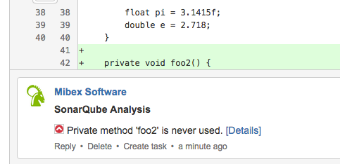

# Bitbucket Cloud plug-in for SonarQube


This SonarQube plug-in creates pull request comments for issues found in your Bitbucket Cloud pull requests. It is very
similar and inspired by the [SonarQube Github plug-in](https://github.com/SonarCommunity/sonar-github), but targets 
Bitbucket Cloud. It creates a summary of the found issues as a global pull request comment which looks like this:


For every found issue on changed or new lines of the pull request, it will also create a pull request comment with
the severity, the explanation what this issue is about and a link to get more details about it:




## This plug-in only supports SonarQube's "preview/issues" mode for analyzing your pull request branches. You cannot use it with "publish" (persistent) mode! 

## Usage

### Prerequisites
- SonarQube >= 4.5.x (note that the plug-in does not work with SonarQube 5.1.0, as this contains a bug which prevents
the plug-in from working correctly; see https://jira.sonarsource.com/browse/SONAR-6398; please use 5.1.2 instead)
- A Bitbucket account
- Maven 3.x + JDK 1.7 (to manually build it)

### Installation

The plug-in will probably once be available in the SonarQube update center. Until then, you can download it from our 
[Github releases page](https://github.com/mibexsoftware/sonar-bitbucket-plugin/releases/latest).

If you want, you can also build the plug-in manually like follows:

```
mvn clean install
```

After you copied the plugin's JAR to `{SONARQUBE_INSTALL_DIRECTORY}/extensions/plugins`, you need to restart your
SonarQube instance.

### Troubleshooting

If you experience any issues with the plug-in, check the build log for any suspicious messages first. The plug-in writes 
messages to the log with the prefix ```[sonar4bitbucket]```. Possible issues are often related to authentication. Please 
make sure that you have configured a callback URL in Bitbucket when using OAuth. If authentication worked but you don't 
see any pull request comments being made for code issues, run the build in debug mode, create a 
[bug report](https://github.com/mibexsoftware/sonar-bitbucket-plugin/issues) and attach important debug log lines to it. 
To generate a log with debug level, use the following parameters to trigger SonarQube:

```
mvn sonar:sonar -X -Dsonar.verbose=true ...
```

### Configuration for Jenkins with Maven

You need to run this plug-in as part of your build. Add a build step of type `Execute shell` to your Jenkins job with
the following content:
 
```
mvn clean verify sonar:sonar --batch-mode --errors \
     -Dsonar.bitbucket.repoSlug=YOUR_BITBUCKET_REPO_SLUG \
     -Dsonar.bitbucket.accountName=YOUR_BITBUCKET_ACCOUNT_NAME \
     -Dsonar.bitbucket.teamName=YOUR_BITBUCKET_TEAM_NAME \
     -Dsonar.bitbucket.apiKey=YOUR_BITBUCKET_API_KEY \
     -Dsonar.bitbucket.branchName=$GIT_BRANCH \
     -Dsonar.host.url=http://YOUR_SONAR_SERVER \
     -Dsonar.login=YOUR_SONAR_LOGIN \
     -Dsonar.password=YOUR_SONAR_PASSWORD \
     -Dsonar.analysis.mode=issues
```
 
See this table about the possible configuration options:


| Parameter name                               | Description                                                                                                                                                                                                                    | Default value                                  | Example                |
|----------------------------------------------|--------------------------------------------------------------------------------------------------------------------------------------------------------------------------------------------------------------------------------|------------------------------------------------|------------------------|
| sonar.bitbucket.repoSlug                     | The slug of your Bitbucket repository (https://bitbucket.org/[account_name]/[repo_slug]).                                                                                                                                      |                                                | sonar-bitbucket-plugin |
| sonar.bitbucket.accountName                  | The Bitbucket account your repository belongs to (https://bitbucket.org/[account_name]/[repo_slug]).                                                                                                                           |                                                | mibexsoftware          |
| sonar.bitbucket.teamName                     | If you want to create pull request comments for Sonar issues under your team account, provide the Bitbucket team ID (not the name) here.                                                                                       |                                                | a_team                 |
| sonar.bitbucket.apiKey                       | If you want to create pull request comments for Sonar issues under your team account, provide the API key for your team account here.                                                                                          |                                                |                        |
| sonar.bitbucket.oauthClientKey               | If you want to create pull request comments for Sonar issues under your personal account, provide the client key of the new OAuth consumer here (needs repository and pull request WRITE permissions).                         |                                                |                        |
| sonar.bitbucket.oauthClientSecret            | If you want to create pull request comments for Sonar issues under your personal account, provide the OAuth client secret for the new OAuth consumer here.                                                                     |                                                |                        |
| sonar.bitbucket.branchName                   | The branch name you want to get analyzed with SonarQube. When building with Jenkins, use $GIT_BRANCH. For Bamboo, you can use ${bamboo.repository.git.branch}.                                                                 |                                                | $GIT_BRANCH            |
| sonar.bitbucket.branchIllegalCharReplacement | If you are using SonarQube version <= 4.5, then you have to escape '/' in your branch names with another character. Please provide this replacement character here.                                                            |                                                | _                      |
| sonar.bitbucket.minSeverity                  | Either INFO, MINOR, MAJOR, CRITICAL or BLOCKER to only have pull request comments created for issues with severities greater or equal to the chosen severity.                                                                  | MAJOR                                          | CRITICAL               |
| sonar.bitbucket.approvalFeatureEnabled       | If enabled, the plug-in will approve the pull request if there are no critical and no blocker issues, otherwise it will unapprove the pull request.                                                                            | true                                           | false                  |


For authentication, you have to decide between if you want to create pull requests under your own user by using OAuth 
or as your team account with an API key. If you have a team account, we suggest to use this one as it is less confusing
if the Sonar issues are created by this account opposed to when a personal account is taken. Unfortunately, Bitbucket
does not (yet) support technical users as GitHub does, so we have to use either a user or team account here.

If you go with OAuth, you have to configure a callback URL and use the Bitbucket permission "Repository write" and 
"Pull requests write" for the new OAuth consumer.
 
If everything is configured as explained, you should see pull request comments for all found Sonar issues in your pull
request after the next push to your Bitbucket repository.


### Configuration for Bamboo with Maven

You need to run this SonarQube plug-in as part of your build. To achieve this, add a build task of type `Maven 3.x` to
your Bamboo job with the following task goal:
 
```
clean verify sonar:sonar --batch-mode --errors \
     -Dsonar.bitbucket.repoSlug=YOUR_BITBUCKET_REPO_SLUG \
     -Dsonar.bitbucket.accountName=YOUR_BITBUCKET_ACCOUNT_NAME \
     -Dsonar.bitbucket.teamName=YOUR_BITBUCKET_TEAM_ID \
     -Dsonar.bitbucket.apiKey=YOUR_BITBUCKET_API_KEY \
     -Dsonar.bitbucket.branchName=${bamboo.repository.git.branch} \
     -Dsonar.host.url=http://YOUR_SONAR_SERVER \
     -Dsonar.login=YOUR_SONAR_LOGIN \
     -Dsonar.password=YOUR_SONAR_PASSWORD \
     -Dsonar.analysis.mode=issues
```

### Configuration with SonarRunner

The configuration of the SonarRunner parameters is actually the same as with Maven. Just run SonarRunner like follows:

```
sonar-runner -Dsonar.analysis.mode=issues <other-options>
```


### Using a proxy

If you use a proxy, you can configure the host and port like follows:

```
-Dhttp.proxyHost=http://localhost -Dhttp.proxyPort=9000
```
